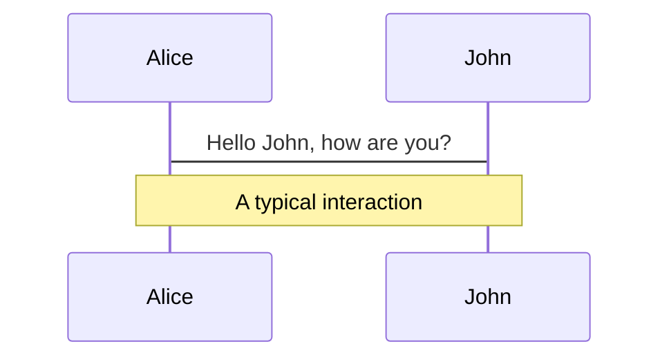
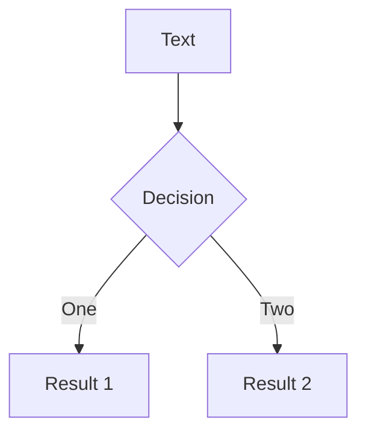
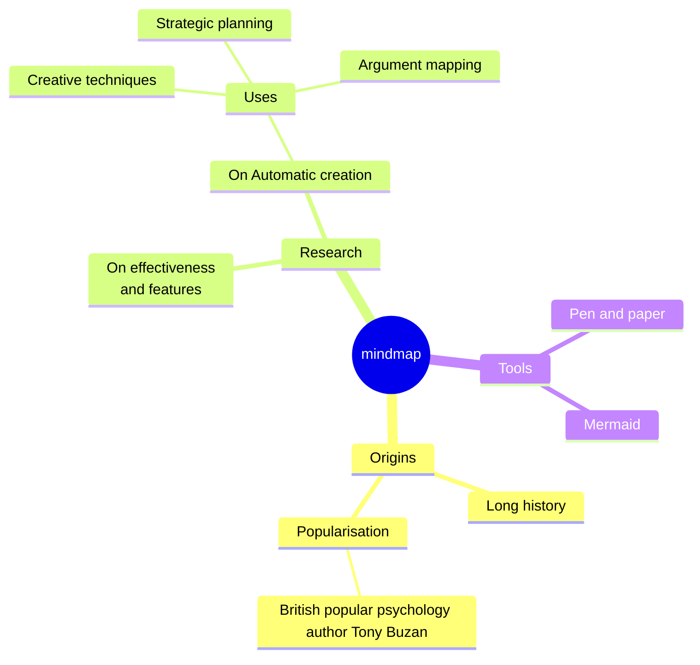
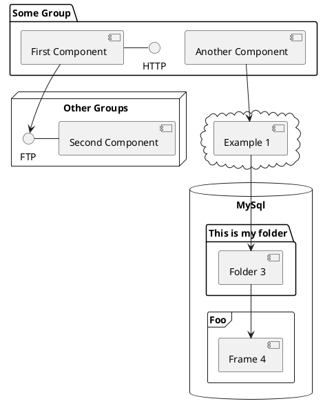

# Forged in Rust,<br>Spoken in Python
## Jan Kislinger
### PyData Prague, November 2025


---

# Outline

- 📝 **Transition from R** - 2018, dplyr -> polars, ggplot2 -> ?, Rcpp -> maturin + pyo3
- 🎨 **Rust features** - error propagation, compiled, strongly typed, borrow checker
- 🧑‍💻 **Tooling** - cargo | pip poetry uv; pytest flake8 ruff; sphynx
- 🤹 **Python features** - int (unbounded), str (cached), dict (sorted)
- 🎥 **Examples** - uv+ruff, polars
- 📤 **Interoperability** - pyo3, maturin, show demo
- 🛠 **pyo3-polars** - how (not) to call python from rust

---

# 2018: R -> Python

- dplyr <span v-click>-> polars</span>
- ggplot2 <span v-click>-> 😔</span>
- Rcpp <span v-click>-> PyO3 + maturin</span>


---
layout: two-cols-header
---

# Jan Kislinger


::left::

- ML Engineer
- Personalization

<br>
<br>

<div style="height:120px; display:flex; align-items:flex-start;">
  
</div>

::right::


- PhD student
- Full-page recommendations

<br>
<br>

<div style="height:120px; display:flex; align-items:flex-start;">
  
</div>

---
layout: image-right
image: https://cdn.jsdelivr.net/gh/slidevjs/slidev-covers@main/static/4uH95YbrT0c.webp
class: text-2xl
---

# Agenda

- Language Comparison
- Successful Stories
- Interoperability

---
layout: section
---

# Language Comparison

## Two different worlds

---

# Rust Features

- Compiled
- Strongly typed
- Traits
- Enum, Option, Result
- Propagated errors
- Borrow checker

---
layout: image-left
image: /assets/rust_book.jpg
backgroundSize: contain
---

# The Rust Book

https://doc.rust-lang.org/book/

---

# Tooling

### Python

- Environment: `pip`, `virtualenv`, `pipx`, `poetry`, <span v-mark.orange.circle="{ at: 1 }">`uv`</span>
- Formatting: `black`, `isort`, `flake8`, <span v-mark.orange.circle="{ at: 1, delay: 250 }">`ruff`</span>
- Static Analysis: `mypy`, <span v-mark.orange.circle="{ at: 1, delay: 600 }">`ty`</span>

<br>

### Rust

- `cargo`


---

# Missing in Rust


<div v-click class="w-full h-full flex flex-col justify-center">

  <div class="text-left big-fill">
    int
  </div>

  <div class="text-center big-fill">
    str
  </div>

  <div class="text-right big-fill">
    dict
  </div>

</div>

<style>
.big-fill {
  font-size: 8vw;
  line-height: 0.9;
}
</style>


---
layout: section
---

# Successful Stories

Written in Rust; Used by Python developers


---
layout: two-cols-header
---

# Python Tooling

https://astral.sh/

::left::


::right::


<style>
.two-cols-header {
  column-gap: 20px; /* Adjust the gap size as needed */
}
</style>


---
layout: two-cols-header
---

# Polars

::left::

- Data frame library
- Backend written in Rust
- 10x - 30x faster than Pandas

<br>

- Lazy expressions 🤗
- No (multi-) indices
- Consistent syntax

::right::

```python
# Pandas
df = pd.read_csv("data.csv")
df = df[df["value"] > 10]
df["double"] = df["value"] * 2
result = (
    df.groupby("category")["double"].mean()
    .reset_index()
)
```

<br>

```python
# Polars
result = (
    pl.scan_csv("data.csv")
    .filter(pl.col("value") > 10)
    .with_columns(double=pl.col("value") * 2)
    .groupby("category")
    .agg(pl.col("double").mean())
    .collect()
)
```

<style>
.two-cols-header {
  column-gap: 20px; /* Adjust the gap size as needed */
}
</style>


---

# Other Examples

## orjson
Fast, correct JSON library for Python.

## Pydantic
Data validation using Python type hints.

## Robyn
High-Performance \[...\] Web Framework with a Rust runtime.

## just, Zed

---
layout: section
---

# Interoperability

## Made Simple

---

# test

<div v-click> visible after 1 click </div>
<v-click at="+2"><div> visible after 3 clicks </div></v-click>
<div v-click.hide="'-1'"> hidden after 2 clicks </div>

```js {none|1|2}{at:'+5'}
1  // highlighted after 7 clicks
2  // highlighted after 8 clicks
```


---
layout: two-cols-header
class: text-2xl
---

# Call Rust from Python

::left::

- Write Rust code

<v-clicks>

- Decorate using <code>pyo3</code> macros
<v-click-gap size="4" />
- Compile &amp; install
<v-click-gap size="0" />
- Run Python

</v-clicks>

::right::

````md magic-move {lines: true, at:0}
```rust {all}{at:0} twoslash
// src/lib.rs
fn fibo(n: u32) -> u32 {
    match n {
        ..2 => 1,  // range(2)
        _ => fibo(n-1) + fibo(n-2)
    }
}
```

```rust {all|2-5,15|2,6|2,8|all}{at:2} twoslash
// src/lib.rs
use pyo3::prelude::*;

#[pymodule]
mod my_lib {
    use super::*;

    #[pyfunction]
    fn fibo(n: u32) -> u32 {
        match n {
            ..2 => 1,
            _ => fibo(n-1) + fibo(n-2)
        }
    }
}
```

```bash {1}
> maturin develop
🍹 Building a mixed python/rust project
🔗 Found pyo3 bindings
🐍 Found CPython 3.13 at .venv/bin/python
📦 Built wheel for CPython 3.13 to <...>.whl
✏️ Setting installed package as editable
🛠 Installed my-lib-0.1.0

```

```python {all}
# main.py
from my_lib import fibo

print(fibo(12))
```
````


---
transition: slide-up
level: 3
---

# Navigation

Hover on the bottom-left corner to see the navigation's controls panel, [learn more](https://sli.dev/guide/ui#navigation-bar)

## Keyboard Shortcuts

|                                                     |                             |
| --------------------------------------------------- | --------------------------- |
| <kbd>right</kbd> / <kbd>space</kbd>                 | next animation or slide     |
| <kbd>left</kbd>  / <kbd>shift</kbd><kbd>space</kbd> | previous animation or slide |
| <kbd>up</kbd>                                       | previous slide              |
| <kbd>down</kbd>                                     | next slide                  |

<!-- https://sli.dev/guide/animations.html#click-animation -->

<p v-after class="absolute bottom-23 left-45 opacity-30 transform -rotate-10">Here!</p>

---
layout: two-cols
layoutClass: gap-16
---

# Table of contents

You can use the `Toc` component to generate a table of contents for your slides:

```html
<Toc minDepth="1" maxDepth="1" />
```

The title will be inferred from your slide content, or you can override it with `title` and `level` in your frontmatter.

::right::

<Toc text-sm minDepth="1" maxDepth="2" />

---
layout: image-right
image: https://cover.sli.dev
---

# Code

Use code snippets and get the highlighting directly, and even types hover!

```ts [filename-example.ts] {all|4|6|6-7|9|all} twoslash
// TwoSlash enables TypeScript hover information
// and errors in markdown code blocks
// More at https://shiki.style/packages/twoslash
import { computed, ref } from 'vue'

const count = ref(0)
const doubled = computed(() => count.value * 2)

doubled.value = 2
```

<arrow v-click="[4, 5]" x1="350" y1="310" x2="195" y2="342" color="#953" width="2" arrowSize="1" />

<!-- This allow you to embed external code blocks -->
<<< @/snippets/external.ts#snippet

<!-- Footer -->

[Learn more](https://sli.dev/features/line-highlighting)

<!-- Inline style -->
<style>
.footnotes-sep {
  @apply mt-5 opacity-10;
}
.footnotes {
  @apply text-sm opacity-75;
}
.footnote-backref {
  display: none;
}
</style>

<!--
Notes can also sync with clicks

[click] This will be highlighted after the first click

[click] Highlighted with `count = ref(0)`

[click:3] Last click (skip two clicks)
-->

---
level: 2
---

# Shiki Magic Move

Powered by [shiki-magic-move](https://shiki-magic-move.netlify.app/), Slidev supports animations across multiple code snippets.

Add multiple code blocks and wrap them with <code>````md magic-move</code> (four backticks) to enable the magic move. For example:

````md magic-move {lines: true}
```ts {*|2|*}
// step 1
const author = reactive({
  name: 'John Doe',
  books: [
    'Vue 2 - Advanced Guide',
    'Vue 3 - Basic Guide',
    'Vue 4 - The Mystery'
  ]
})
```

```ts {*|1-2|3-4|3-4,8}
// step 2
export default {
  data() {
    return {
      author: {
        name: 'John Doe',
        books: [
          'Vue 2 - Advanced Guide',
          'Vue 3 - Basic Guide',
          'Vue 4 - The Mystery'
        ]
      }
    }
  }
}
```

```ts
// step 3
export default {
  data: () => ({
    author: {
      name: 'John Doe',
      books: [
        'Vue 2 - Advanced Guide',
        'Vue 3 - Basic Guide',
        'Vue 4 - The Mystery'
      ]
    }
  })
}
```

Non-code blocks are ignored.

```vue
<!-- step 4 -->
<script setup>
const author = {
  name: 'John Doe',
  books: [
    'Vue 2 - Advanced Guide',
    'Vue 3 - Basic Guide',
    'Vue 4 - The Mystery'
  ]
}
</script>
```
````

---

# Components

<div grid="~ cols-2 gap-4">
<div>

You can use Vue components directly inside your slides.

We have provided a few built-in components like `<Tweet/>` and `<Youtube/>` that you can use directly. And adding your custom components is also super easy.

```html
<Counter :count="10" />
```

<!-- ./components/Counter.vue -->
<Counter :count="10" m="t-4" />

Check out [the guides](https://sli.dev/builtin/components.html) for more.

</div>
<div>

```html
<Tweet id="1390115482657726468" />
```

<Tweet id="1390115482657726468" scale="0.65" />

</div>
</div>

<!--
Presenter note with **bold**, *italic*, and ~~striked~~ text.

Also, HTML elements are valid:
<div class="flex w-full">
  <span style="flex-grow: 1;">Left content</span>
  <span>Right content</span>
</div>
-->

---
class: px-20
---

# Themes

Slidev comes with powerful theming support. Themes can provide styles, layouts, components, or even configurations for tools. Switching between themes by just **one edit** in your frontmatter:

<div grid="~ cols-2 gap-2" m="t-2">

```yaml
---
theme: default
---
```

```yaml
---
theme: seriph
---
```


</div>

Read more about [How to use a theme](https://sli.dev/guide/theme-addon#use-theme) and
check out the [Awesome Themes Gallery](https://sli.dev/resources/theme-gallery).

---

# Clicks Animations

You can add `v-click` to elements to add a click animation.

<div v-click>

This shows up when you click the slide:

```html
<div v-click>This shows up when you click the slide.</div>
```

</div>

<br>

<v-click>

The <span v-mark.red="3"><code>v-mark</code> directive</span>
also allows you to add
<span v-mark.circle.orange="4">inline marks</span>
, powered by [Rough Notation](https://roughnotation.com/):

```html
<span v-mark.underline.orange>inline markers</span>
```

</v-click>

<div mt-20 v-click>

[Learn more](https://sli.dev/guide/animations#click-animation)

</div>

---

# Motions

Motion animations are powered by [@vueuse/motion](https://motion.vueuse.org/), triggered by `v-motion` directive.

```html
<div
  v-motion
  :initial="{ x: -80 }"
  :enter="{ x: 0 }"
  :click-3="{ x: 80 }"
  :leave="{ x: 1000 }"
>
  Slidev
</div>
```

<div class="w-60 relative">
  <div class="relative w-40 h-40">
    
    
    
  </div>

  <div
    class="text-5xl absolute top-14 left-40 text-[#2B90B6] -z-1"
    v-motion
    :initial="{ x: -80, opacity: 0}"
    :enter="{ x: 0, opacity: 1, transition: { delay: 2000, duration: 1000 } }">
    Slidev
  </div>
</div>

<!-- vue script setup scripts can be directly used in markdown, and will only affects current page -->
<script setup lang="ts">
const final = {
  x: 0,
  y: 0,
  rotate: 0,
  scale: 1,
  transition: {
    type: 'spring',
    damping: 10,
    stiffness: 20,
    mass: 2
  }
}
</script>

<div
  v-motion
  :initial="{ x:35, y: 30, opacity: 0}"
  :enter="{ y: 0, opacity: 1, transition: { delay: 3500 } }">

[Learn more](https://sli.dev/guide/animations.html#motion)

</div>

---

# LaTeX

LaTeX is supported out-of-box. Powered by [KaTeX](https://katex.org/).

<div h-3 />

Inline $\sqrt{3x-1}+(1+x)^2$

Block
$$ {1|3|all}
\begin{aligned}
\nabla \cdot \vec{E} &= \frac{\rho}{\varepsilon_0} \\
\nabla \cdot \vec{B} &= 0 \\
\nabla \times \vec{E} &= -\frac{\partial\vec{B}}{\partial t} \\
\nabla \times \vec{B} &= \mu_0\vec{J} + \mu_0\varepsilon_0\frac{\partial\vec{E}}{\partial t}
\end{aligned}
$$

[Learn more](https://sli.dev/features/latex)

---

# Diagrams

You can create diagrams / graphs from textual descriptions, directly in your Markdown.

<div class="grid grid-cols-4 gap-5 pt-4 -mb-6">









</div>

Learn more: [Mermaid Diagrams](https://sli.dev/features/mermaid) and [PlantUML Diagrams](https://sli.dev/features/plantuml)

---
foo: bar
dragPos:
  square: 691,32,167,_,-16
---

# Draggable Elements

Double-click on the draggable elements to edit their positions.

<br>

###### Directive Usage

```md

```

<br>

###### Component Usage

```md
<v-drag text-3xl>
  <div class="i-carbon:arrow-up" />
  Use the `v-drag` component to have a draggable container!
</v-drag>
```

<v-drag pos="663,206,261,_,-15">
  <div text-center text-3xl border border-main rounded>
    Double-click me!
  </div>
</v-drag>


###### Draggable Arrow

```md
<v-drag-arrow two-way />
```

<v-drag-arrow pos="67,452,253,46" two-way op70 />

---
src: ./pages/imported-slides.md
hide: false
---

---

# Monaco Editor

Slidev provides built-in Monaco Editor support.

Add `{monaco}` to the code block to turn it into an editor:

```ts {monaco}
import { ref } from 'vue'
import { emptyArray } from './external'

const arr = ref(emptyArray(10))
```

Use `{monaco-run}` to create an editor that can execute the code directly in the slide:

```ts {monaco-run}
import { version } from 'vue'
import { emptyArray, sayHello } from './external'

sayHello()
console.log(`vue ${version}`)
console.log(emptyArray<number>(10).reduce(fib => [...fib, fib.at(-1)! + fib.at(-2)!], [1, 1]))
```

---
layout: center
class: text-center
---

# Learn More

[Documentation](https://sli.dev) · [GitHub](https://github.com/slidevjs/slidev) · [Showcases](https://sli.dev/resources/showcases)

<PoweredBySlidev mt-10 />
